<!-- Generated by GitHub Profile Agent Console. Edit profile.config.json, then run npm run generate. -->

  <picture>
    <source media="(max-width: 760px) and (prefers-color-scheme: dark)" srcset="./assets/hero/agent-console-b1073d36-mobile-dark.svg">
    <source media="(max-width: 760px)" srcset="./assets/hero/agent-console-b1073d36-mobile-light.svg">
    <source media="(prefers-color-scheme: dark)" srcset="./assets/hero/agent-console-b1073d36-dark.svg">
    <source media="(prefers-color-scheme: light)" srcset="./assets/hero/agent-console-b1073d36-light.svg">
    
  </picture>

  
  
  

## About Me

I work as an Assistant QA/QC Engineer at PT HLN Batam, where I focus on maintaining quality standards across manufacturing processes through systematic inspection, root cause analysis, and continuous improvement.

My approach combines hands-on quality control techniques with documented management systems to ensure products meet rigorous specifications and regulatory requirements.

## Current Focus

| Area | What I am exploring |
| --- | --- |
| **Quality Systems** | Implementing and maintaining ISO 9001, ISO 14001, ISO 45001, and ISO 19011 compliant quality frameworks. |
| **Process Improvement** | Applying SPC, root cause analysis, 8D reports, FMEA, and CAPA to reduce defects and optimize production quality. |
| **Inspections & QA** | Conducting IQC inspections using SmartScope and other tools to ensure materials and products meet specifications. |
| **Quality Tools** | Building digital tools and dashboards to streamline QA workflows, track defects, and visualize quality metrics. |

## Featured Work

| Project | Focus | Why it matters |
| --- | --- | --- |
| [**IQC Inspection**](https://github.com/Prasadboy-ux/IQC-Inspection-System) | Incoming quality control automation | A digital system for managing incoming quality inspections, tracking defects, and generating compliance reports. |
| [**QA Dashboard**](https://github.com/Prasadboy-ux/QA-Engineering-Dashboard) | Quality metrics visualization | An interactive dashboard for monitoring quality KPIs, defect trends, and process capability metrics in real time. |
| [**Rubber Mfg SPC**](https://github.com/Prasadboy-ux/Rubber-Manufacturing-SPC-System) | Statistical process control | A specialized SPC system for rubber manufacturing processes to monitor variability and maintain product consistency. |
| [**NextGenAcademy**](https://github.com/Prasadboy-ux/NextGenAcademy) | Educational platform | A modern learning platform designed to deliver quality education content with an intuitive user experience. |
| [**Portfolio Website**](https://github.com/Prasadboy-ux/Prasadboy-ux) | Professional portfolio | A curated portfolio showcasing my QA/QC projects, technical skills, and professional journey. |

## Research Direction

I am focused on building dependable quality systems that integrate statistical process control, ISO standards compliance, and structured problem-solving methods. My goal is to ensure every product and process meets defined quality thresholds through systematic inspection, data-driven decisions, and continuous improvement frameworks such as CAPA and FMEA.

## Tech Stack

`HTML` · `CSS` · `JavaScript` · `Git` · `VS Code` · `Microsoft Excel` · `SPC` · `ISO 9001` · `ISO 14001` · `ISO 45001` · `ISO 19011` · `Quality Assurance` · `Quality Control` · `SmartScope` · `Root Cause Analysis` · `8D Report` · `FMEA` · `CAPA`

## Recent Activity

<!-- AUTO:ACTIVITY:START -->
_Recent public activity will appear here after the workflow runs._
<!-- AUTO:ACTIVITY:END -->

---

  Building quality systems that deliver reliable results.

