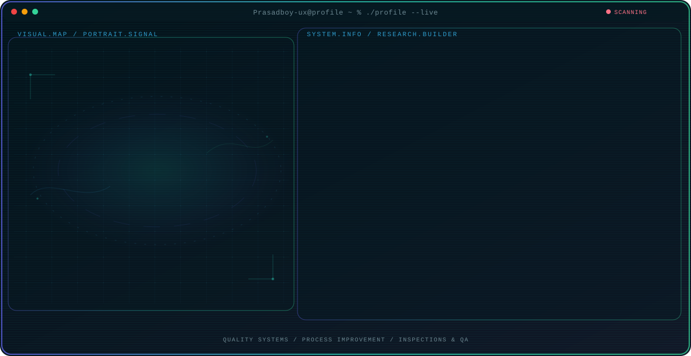

<!-- Generated by GitHub Profile Agent Console. Edit profile.config.json, then run npm run generate. -->

<!-- ═══════════════════════════════════ HEADER ═══════════════════════════════════ -->

<p align="center">
  
</p>

<!-- ═══════════════════════════════════ HERO BANNER ═══════════════════════════════════ -->

<p align="center">
  <picture>
    <source media="(max-width: 760px) and (prefers-color-scheme: dark)" srcset="./assets/hero/agent-console-b1073d36-mobile-dark.svg">
    <source media="(max-width: 760px)" srcset="./assets/hero/agent-console-b1073d36-mobile-light.svg">
    <source media="(prefers-color-scheme: dark)" srcset="./assets/hero/agent-console-b1073d36-dark.svg">
    <source media="(prefers-color-scheme: light)" srcset="./assets/hero/agent-console-b1073d36-light.svg">
    
  </picture>
</p>

<!-- ═══════════════════════════════════ SOCIAL BADGES ═══════════════════════════════════ -->

<p align="center">
  <a href="https://github.com/Prasadboy-ux"></a>&nbsp;
  <a href="https://www.linkedin.com/in/prakash-prasad-550a1a1a8/"></a>&nbsp;
  <a href="https://wa.me/62876388215"></a>
</p>

<!-- ═══════════════════════════════════ TYPING SVG ═══════════════════════════════════ -->

<p align="center">
  <a href="https://github.com/Prasadboy-ux">
    
  </a>
</p>

<p align="center">
  
  &nbsp;
  
  &nbsp;
  
</p>

---

<!-- ═══════════════════════════════════ ABOUT ME ═══════════════════════════════════ -->

##  &nbsp;About Me

```yaml
Name:       Prakash Prasad
Role:       Assistant QA/QC Engineer
Company:    PT HLN Batam
Location:   Batam, Indonesia 🇮🇩
Focus:      Quality Assurance · Process Improvement · Statistical Analysis

Certifications:
  - ISO 9001  (Quality Management)
  - ISO 14001 (Environmental Management)
  - ISO 45001 (Occupational Health & Safety)
  - ISO 19011 (Auditing Management Systems)

Tools:      SmartScope · SPC · 8D Reports · FMEA · CAPA · Root Cause Analysis
Languages:  HTML · CSS · JavaScript
Editors:    VS Code · Git
```

> *"Quality is not an act, it is a habit."* — Aristotle

---

<!-- ═══════════════════════════════════ CURRENT FOCUS ═══════════════════════════════════ -->

## 🎯 &nbsp;Current Focus

<table>
<tr>
<td width="50%">

### 🏗️ Quality Systems
Implementing and maintaining **ISO 9001**, **ISO 14001**, **ISO 45001**, and **ISO 19011** compliant quality frameworks.

### 🔬 Inspections & QA
Conducting IQC inspections using **SmartScope** and other precision tools to ensure materials and products meet specifications.

</td>
<td width="50%">

### 📈 Process Improvement
Applying **SPC**, root cause analysis, **8D reports**, **FMEA**, and **CAPA** to reduce defects and optimize production quality.

### 🛠️ Quality Tools
Building digital tools and dashboards to streamline QA workflows, track defects, and visualize quality metrics.

</td>
</tr>
</table>

---

<!-- ═══════════════════════════════════ TECH STACK ═══════════════════════════════════ -->

## 🧰 &nbsp;Tech Stack & Quality Toolkit

<p align="center">
  
</p>

<p align="center">
  
  
  
  
</p>

<p align="center">
  
  
  
  
  
  
</p>

---

<!-- ═══════════════════════════════════ FEATURED WORK ═══════════════════════════════════ -->

## 🚀 &nbsp;Featured Projects

<table>
<tr>
<td width="50%">

<h3 align="center">🔍 IQC Inspection System</h3>
<p align="center">
  <a href="https://github.com/Prasadboy-ux/IQC-Inspection-System">
    
  </a>
</p>
<p align="center"><em>Incoming quality control automation — manage inspections, track defects, and generate compliance reports.</em></p>

</td>
<td width="50%">

<h3 align="center">📊 QA Engineering Dashboard</h3>
<p align="center">
  <a href="https://github.com/Prasadboy-ux/QA-Engineering-Dashboard">
    
  </a>
</p>
<p align="center"><em>Interactive dashboard for monitoring quality KPIs, defect trends, and process capability metrics in real time.</em></p>

</td>
</tr>
<tr>
<td width="50%">

<h3 align="center">📉 Rubber Mfg SPC System</h3>
<p align="center">
  <a href="https://github.com/Prasadboy-ux/Rubber-Manufacturing-SPC-System">
    
  </a>
</p>
<p align="center"><em>Specialized SPC system for rubber manufacturing — monitor variability and maintain product consistency.</em></p>

</td>
<td width="50%">

<h3 align="center">🎓 NextGenAcademy</h3>
<p align="center">
  <a href="https://github.com/Prasadboy-ux/NextGenAcademy">
    
  </a>
</p>
<p align="center"><em>Modern learning platform designed to deliver quality education content with an intuitive user experience.</em></p>

</td>
</tr>
</table>

---

<!-- ═══════════════════════════════════ GITHUB STATS ═══════════════════════════════════ -->

## 📊 &nbsp;GitHub Analytics

<p align="center">
  
  
</p>

<p align="center">
  
  
</p>

<p align="center">
  
</p>

---

<!-- ═══════════════════════════════════ SNAKE ═══════════════════════════════════ -->

## 🐍 &nbsp;Contribution Snake

<p align="center">
  <picture>
    <source media="(prefers-color-scheme: dark)" srcset="https://raw.githubusercontent.com/Prasadboy-ux/prasad-profile/output/github-contribution-grid-snake-dark.svg" />
    <source media="(prefers-color-scheme: light)" srcset="https://raw.githubusercontent.com/Prasadboy-ux/prasad-profile/output/github-contribution-grid-snake.svg" />
    
  </picture>
</p>

---

<!-- ═══════════════════════════════════ RESEARCH ═══════════════════════════════════ -->

## 🔬 &nbsp;Research Direction

<blockquote>

I am focused on building **dependable quality systems** that integrate statistical process control, ISO standards compliance, and structured problem-solving methods. My goal is to ensure every product and process meets defined quality thresholds through **systematic inspection**, **data-driven decisions**, and continuous improvement frameworks such as **CAPA** and **FMEA**.

</blockquote>

---

<!-- ═══════════════════════════════════ ACTIVITY ═══════════════════════════════════ -->

## ⚡ &nbsp;Recent Activity

<!-- AUTO:ACTIVITY:START -->
_Recent public activity will appear here after the workflow runs._
<!-- AUTO:ACTIVITY:END -->

---

<!-- ═══════════════════════════════════ FOOTER ═══════════════════════════════════ -->

<p align="center">
  
</p>

<p align="center">
  <b>Building quality systems that deliver reliable results.</b>
</p>

<p align="center">
  
</p>
